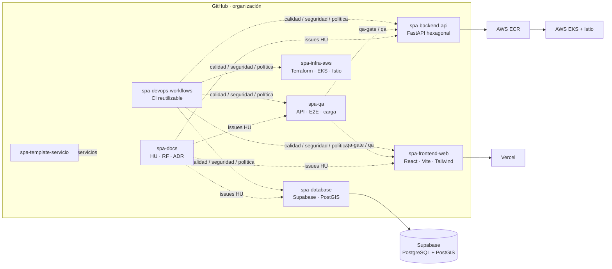

# Bootstrap de la organización GitHub · Spa de Uñas (Inventario)

Aprovisiona **de forma idempotente** toda la organización: equipos, 9 repositorios con su esqueleto
funcional (CI en verde desde el primer commit), permisos por equipo, etiquetas, milestones, protección de
ramas con checks obligatorios, puerta de QA desactivable, 13 historias de usuario + 10 decisiones pendientes
como issues, y el tablero de proyecto.

## Arquitectura de la organización



| Repositorio | Visibilidad | Dueño | Ramas protegidas | Checks obligatorios |
|---|---|---|---|---|
| `.github` | pública | plataforma-admins | main | revisión |
| `spa-docs` | privada | equipo-analistas | main | revisión |
| `spa-database` | privada | equipo-datos | main, develop | politica · calidad · seguridad |
| `spa-backend-api` | privada | equipo-backend | main, develop | politica · calidad · seguridad · **qa-gate*** |
| `spa-frontend-web` | privada | equipo-frontend | main, develop | politica · calidad · seguridad · **qa-gate*** |
| `spa-qa` | privada | equipo-qa | main, develop | politica · calidad |
| `spa-devops-workflows` | privada | equipo-devops | main | revisión |
| `spa-infra-aws` | privada | equipo-devops | main, develop | politica · calidad · seguridad |
| `spa-template-servicio` | privada (template) | equipo-devops | main | calidad |

\* `qa-gate / qa` se exige al poner `ENABLE_QA_GATE="true"` y re-ejecutar el paso 06.

Equipos: `plataforma-admins`, `equipo-backend`, `equipo-frontend`, `equipo-datos`, `equipo-devops`,
`equipo-qa`, `equipo-analistas`. Matriz exacta de permisos en `config/permisos.json`.

## 1. Prerrequisitos (una sola vez, manual)

1. Crear la organización en https://github.com/account/organizations/new (su login = `ORG`).
2. Plan **GitHub Team**: en plan Free los rulesets no se aplican en repos privados (la puerta de QA no bloquearía).
3. Settings → Authentication security → exigir 2FA.
4. Herramientas: `gh` ≥ 2.50, `git`, `jq`, `perl` (Linux/macOS, o Windows con **Git Bash** o **WSL**).
5. Autenticación e identidad de commits:
   ```bash
   gh auth login
   gh auth refresh -h github.com -s admin:org,repo,workflow,project
   git config --global user.name "Su Nombre"; git config --global user.email "su@correo"
   ```

## 2. Configurar

| Archivo | Qué editar |
|---|---|
| `config/org.env` | `ORG`, aprobaciones requeridas, `ENABLE_QA_GATE` |
| `config/miembros.json` | Logins de GitHub por equipo y colaboradores externos por repo |
| `config/permisos.json` | Matriz equipo ↔ repositorio (pull, triage, push, maintain, admin) |
| `config/repos.json` | Repositorios, entornos, checks obligatorios |
| `config/historias.json` · `decisiones.json` | Historias de usuario y decisiones pendientes |

## 3. Ejecutar

```bash
chmod +x bootstrap.sh scripts/*.sh
./bootstrap.sh                 # todo (00→08); es seguro re-ejecutarlo
./bootstrap.sh 01 03           # solo equipos/integrantes y permisos (p. ej. al sumar personas)
```

| Paso | Script | Resultado |
|---|---|---|
| 00 | `00_prerequisitos.sh` | Valida gh/owner/plan; permiso base `none`; solo owners crean repos; variable `ENABLE_QA_GATE` |
| 01 | `01_equipos.sh` | 7 equipos + integrantes (invitaciones) |
| 02 | `02_repositorios.sh` | 9 repos, solo squash merge, borrar rama al fusionar, Dependabot, entornos, topics |
| 03 | `03_permisos.sh` | Permisos equipo↔repo y colaboradores externos |
| 04 | `04_labels_milestones.sh` | 24 etiquetas en todos los repos; milestones M0–M5 |
| 05 | `05_semilla.sh` | Esqueleto de cada repo en `main` y creación de `develop` |
| 06 | `06_proteccion_ramas.sh` | Rulesets: PR + CODEOWNERS + lineal + checks (+ QA gate) |
| 07 | `07_historias.sh` | HU-01…HU-13 y DEC-01…DEC-10 como issues en `spa-docs` |
| 08 | `08_proyecto.sh` | Tablero Projects v2 vinculado a los repos con todas las HU |

## 4. Sumar integrantes

Agregar el login en `config/miembros.json` bajo el equipo correspondiente y ejecutar `./bootstrap.sh 01`.
Para una persona externa en un solo repositorio: `colaboradores_externos` y `./bootstrap.sh 03`.

## 5. Activar el módulo de QA como puerta de merge

1. Token fine-grained con *Contents: Read* sobre `spa-qa` → secreto de organización `QA_READ_TOKEN`.
2. `ENABLE_QA_GATE="true"` en `config/org.env` → `./bootstrap.sh 06`.

Desde ese momento todo PR a `develop`/`main` de backend y frontend levanta el componente, ejecuta la suite
de `spa-qa` y **no permite el merge** si falla.

## 6. Sumar una tecnología o servicio nuevo

Registrar `spa-svc-<dominio>` en `repos.json` y `permisos.json`, crearlo desde `spa-template-servicio`
y ejecutar `./bootstrap.sh 02 03 04 06`. Hereda CI, seguridad, CODEOWNERS y reglas sin tocar los demás repos.
