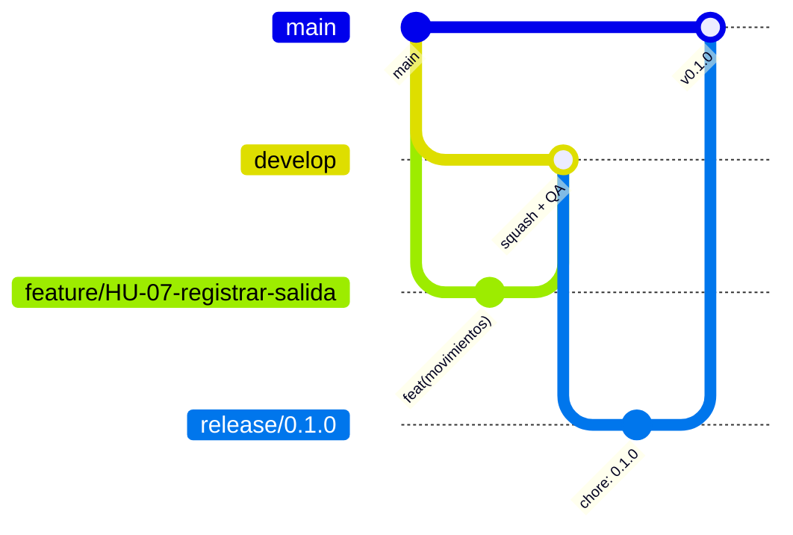

# Flujo de trabajo

1. Tomar la HU del tablero y crear `feature/HU-xx-descripcion` desde `develop` en cada repo impactado.
2. PR a `develop` con título Conventional Commits y `Closes <org>/spa-docs#n`.
3. Checks automáticos + revisión CODEOWNERS (+ `qa-gate / qa` cuando esté activo) → squash merge.
4. Release: `release/x.y.z` → PR a `main` → tag `vx.y.z` → despliegue.

## Definición de Terminado

Criterios de aceptación cumplidos · pruebas unitarias y de QA con marca de HU · checks en verde ·
revisión aprobada · documentación/ADR actualizada · desplegado en staging.
